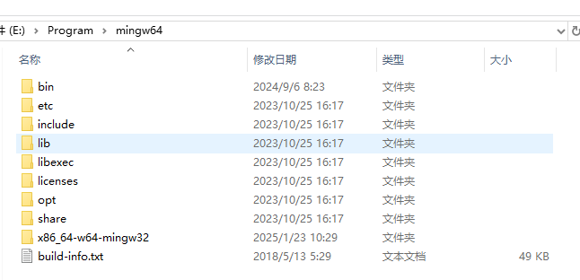
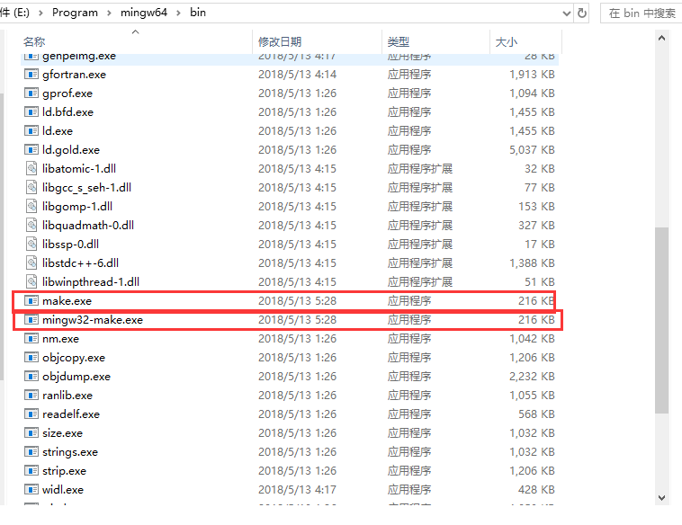
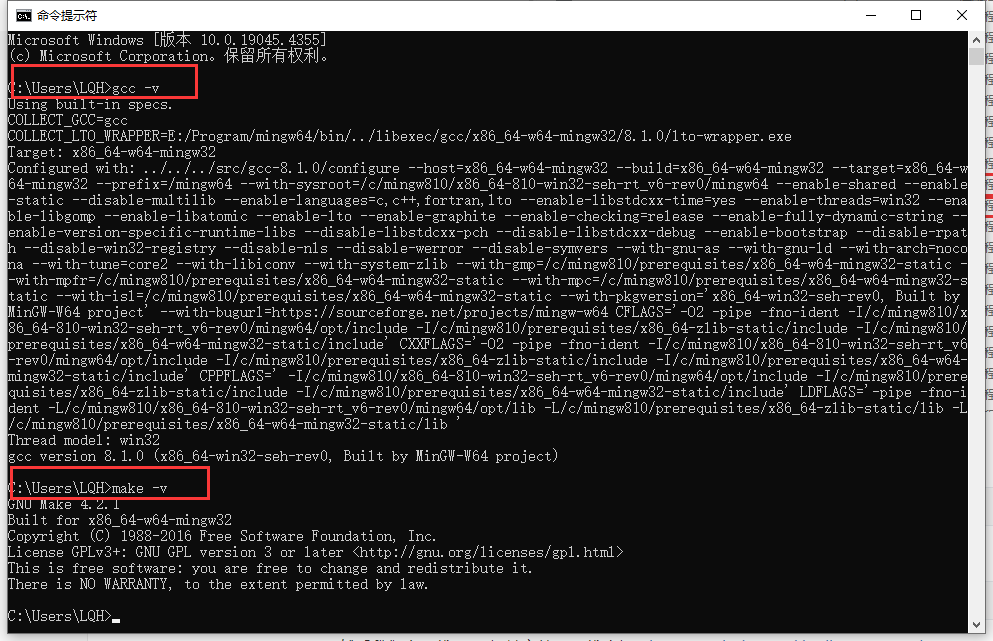
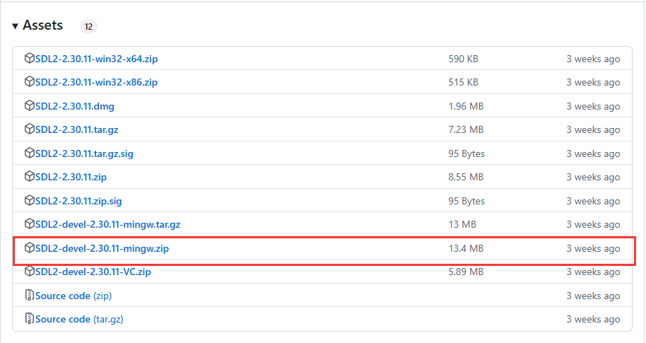
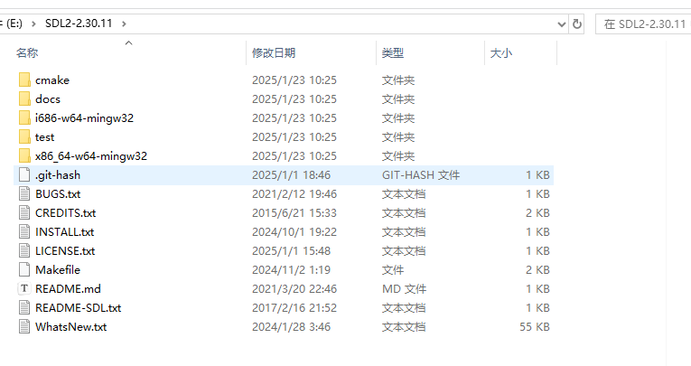
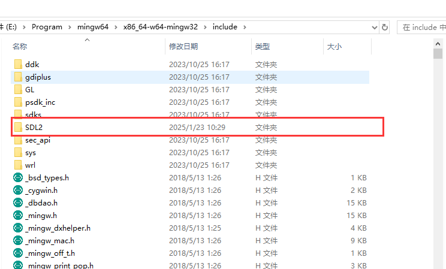
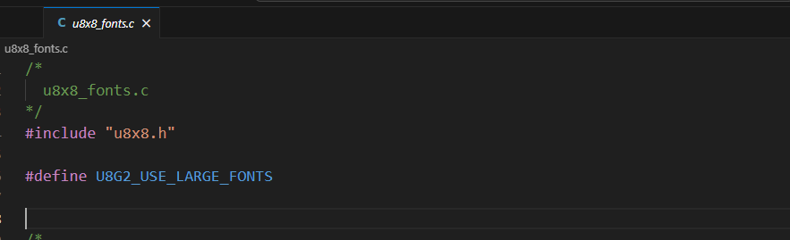

## 项目说明

这个项目是我在Windows环境下使用vscode配置使用SDL和U8G2图形库进行模拟仿真，方便U8G2的调试。

本项目地址：https://github.com/snqx-lqh/u8g2-windows-sdl-simulate

u8g2的开源链接：https://github.com/olikraus/u8g2

## 环境配置

首先我们需要安装mingw编译环境，这个网上有挺多教程，我暂时不做说明，可以直接把我提供的在tools里面mingw64解压。安装完成后就有以下目录



如果是自己安装的，在bin目录下有一个**mingw32-make.exe**，将其复制一份，命名为**make.exe**



记得添加环境变量，主要把以下路径加入环境变量，实际的路径，根据自己的安装环境定。

```
E:\Program\mingw64\bin
```

加入后，可以打开**cmd**测试**gcc**和**make**是否配置成功



然后我们去下载SDL2相关文件，下载路径：https://github.com/libsdl-org/SDL/releases

他的版本已经到3.x了，但是为了不出问题，我们下载2.x的。下载图中文件。



下载后解压，处理**SDL2-devel-2.30.11-mingw.zip**，它解压后应该是如下：



然后把其中的**x86_64-w64-mingw32**文件夹，复制到我们之前安装的mingw的相同文件目录下，直接覆盖，理论上应该也不会有重复，复制完成后，能发现有一些文件夹多了SDL相关的配置。



 

## 代码处理

为了处理方便，我们建立一个新的文件夹来处理我们的仿真，我这里建立了**sdl-sim**文件夹，然后把**csrc**文件夹放在其中，然后将u8g2的**sys/sdl/common**文件夹中的两个文件**u8x8_d_sdl_128x64.c**和**u8x8_sdl_key.c**也复制到**csrc**文件夹中。然后写一个Makefile

Makefile主要记得，需要包含自己的SDL路径，还有链接的路径也要和自己的lib路径一样

```makefile
# 编译器
CC = gcc
# 编译选项 记得更换自己的SDL2路径，就在你的mingw64路径下   ！！！！！！！！！！！！！！记得修改！！！！！！！！！！！！！！！！
CFLAGS = -Wall -Wextra -O2 -Icsrc -IE:/Program/mingw64/x86_64-w64-mingw32/include/SDL2
# 链接选项   ！！！！！！！！！！！！！！记得修改！！！！！！！！！！！！！！！！
LDFLAGS = -LE:/Program/mingw64/x86_64-w64-mingw32/lib -lSDL2
# 目标可执行文件
TARGET = main.exe
# 源文件
SRCS = main.c
# u8g2 源文件
U8G2_SRCS = $(wildcard csrc/*.c)
# 所有源文件
ALL_SRCS = $(SRCS) $(U8G2_SRCS)
# 目标文件
OBJS = $(ALL_SRCS:.c=.o)
# 默认目标
all: $(TARGET)
# 生成可执行文件
$(TARGET): $(OBJS)
	$(CC) -o $@ $^ $(LDFLAGS)
# 编译规则
%.o: %.c
	$(CC) $(CFLAGS) -c $< -o $@
# 清理生成的文件
clean:
	rm -f $(OBJS) $(TARGET)
# 伪目标
.PHONY: all clean
```

并编写一个测试文件main.c。

```c
#include "csrc/u8g2.h"
#include <stdio.h>

u8g2_t u8g2;

int main(void)
{
  int x, y;

  int k;
  int i;

  u8g2_SetupBuffer_SDL_128x64_4(&u8g2, &u8g2_cb_r0);
  u8x8_InitDisplay(u8g2_GetU8x8(&u8g2));
  u8x8_SetPowerSave(u8g2_GetU8x8(&u8g2), 0);

  u8g2_SetFont(&u8g2, u8g2_font_helvB18_tn);

  x = 50;
  y = 30;

  for (;;)
  {
    u8g2_FirstPage(&u8g2);
    i = 0;
    do
    {
      u8g2_SetFontDirection(&u8g2, 0);
      u8g2_DrawStr(&u8g2, x, y, "123");
      u8g2_SetFontDirection(&u8g2, 1);
      u8g2_DrawStr(&u8g2, x, y, "123");
      u8g2_SetFontDirection(&u8g2, 2);
      u8g2_DrawStr(&u8g2, x, y, "123");
      u8g2_SetFontDirection(&u8g2, 3);
      u8g2_DrawStr(&u8g2, x, y, "123");
      if (i == 1)
      {
        u8g2_DrawHVLine(&u8g2, u8g2.user_x0, u8g2.user_y0, 1, 0);
        u8g2_DrawHVLine(&u8g2, u8g2.user_x0, u8g2.user_y1 - 1, 1, 0);
        u8g2_DrawHVLine(&u8g2, u8g2.user_x1 - 1, u8g2.user_y1 - 1, 1, 0);
        u8g2_DrawHVLine(&u8g2, u8g2.user_x1 - 1, u8g2.user_y0, 1, 0);
      }

      i++;

    } while (u8g2_NextPage(&u8g2));

    do
    {
      k = u8g_sdl_get_key();
    } while (k < 0);

    if (k == 273)
      y -= 7;
    if (k == 274)
      y += 7;
    if (k == 276)
      x -= 7;
    if (k == 275)
      x += 7;

    if (k == 'e')
      y -= 1;
    if (k == 'x')
      y += 1;
    if (k == 's')
      x -= 1;
    if (k == 'd')
      x += 1;
    if (k == 'q')
      break;
  }
  return 0;
}

```

然后在终端中make即可

```bash
make
./main.exe
```

## 字体处理

后续操作中发现无法使用部分字体，然后看源代码，他的font有一个`#ifdef U8G2_USE_LARGE_FONTS`选项，所以为了能够使用每个字体。我们在两个字体文件前面分别加上`#define U8G2_USE_LARGE_FONTS`，分别是文件`u8g2_fonts.c`和文件`u8x8_fonts.c`。这样，就能使用很多字体了。


