## 下载u8g2

u8g2的开源网址是：https://github.com/olikraus/u8g2

## 处理源文件到工程目录

下载后，我们需要的文件只是其中的C源文件，当然他里面还有许多工具文件，暂时不需要。

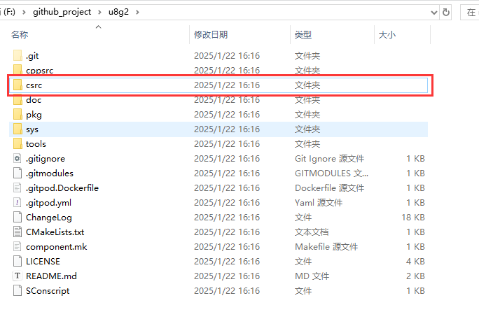

我们将该文件夹改名为U8G2然后放入我们的工程文件中。

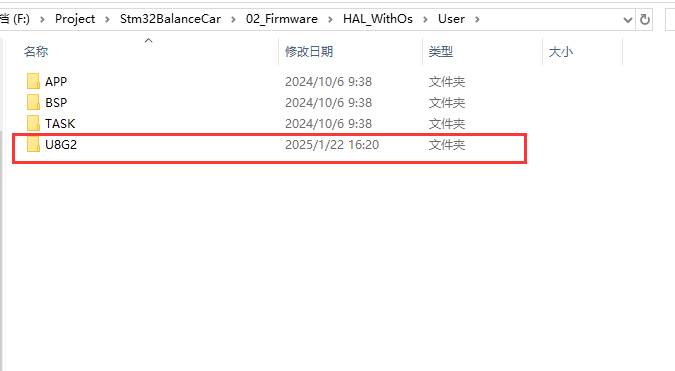

然后在项目中创建文件夹，先把所有的工程文件加入进去，记得把文件夹路径也加入编译路径，不然会编译报错。**加入完成后，先不忙编译。**

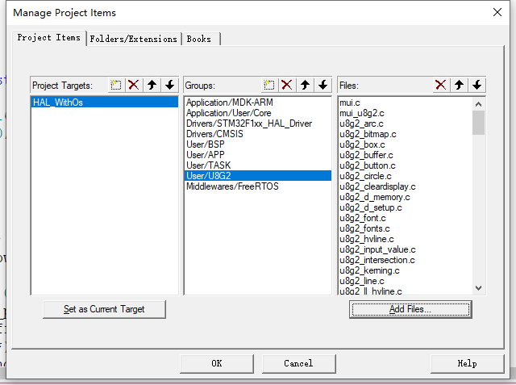

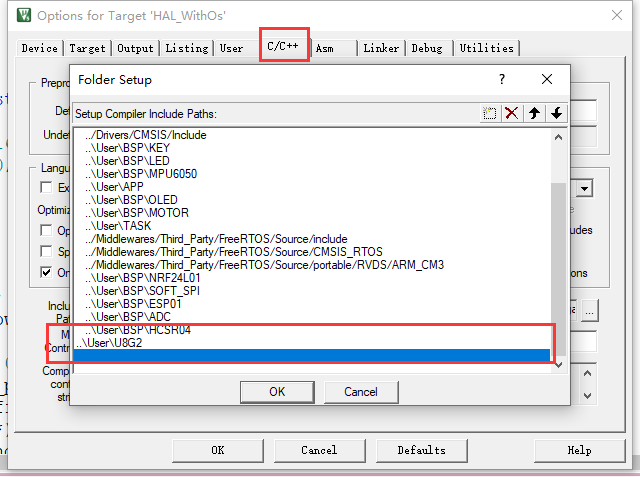

加入完成后，先不忙编译，还需要做以下处理，先使用文件管理器，去掉不需要的驱动文件，我们这里使用的是SSD1306_128X64的屏幕，所以留下这一个就可以了。这些驱动文件通常是**u8x8_d_xxx.c**。我们只使用**u8x8_ssd1306_128x64_noname.c**这个文件，其它的文件可以删掉。这样之后，也不忙编译。

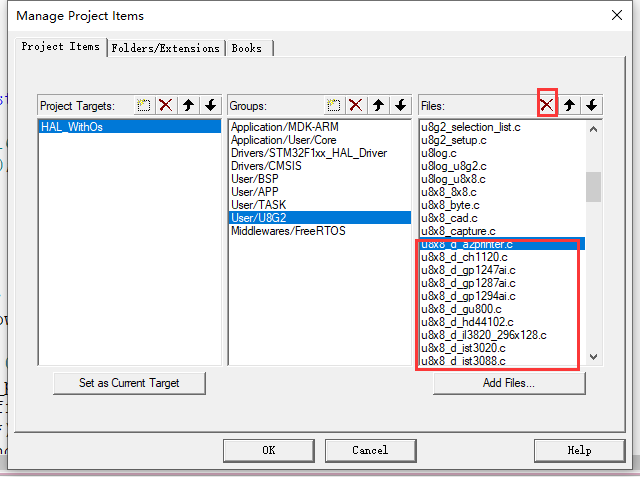

## 精简源文件设置

然后我们查看**u8g2_d_setup.c**这个文件，这个文件里面包含了所有驱动的设置函数，如缓冲配置等。由于文件太大，占用空间比较大，我们一般会删除成只有自己想要的那几个设置，可以在文件夹中**留一个备份文件**后修改，方便其他驱动的移植。

我在这里会留下下列函数

```c
u8g2_Setup_ssd1306_128x64_noname_1
u8g2_Setup_ssd1306_128x64_noname_2
u8g2_Setup_ssd1306_128x64_noname_f
u8g2_Setup_ssd1306_i2c_128x64_noname_1
u8g2_Setup_ssd1306_i2c_128x64_noname_2
u8g2_Setup_ssd1306_i2c_128x64_noname_f
其中，前面3个，是给SPI接口的OLED用的
函数最后的数字或字母，代表显示时的buf大小：
1：128字节
2：256字节
f：1024字节
```

然后我们查看**u8g2_d_memory.c**这个文件，这个文件里面包含了定义的缓冲大小。我们只留下上面几个函数中用到的函数，可以在文件夹中**留一个备份文件**后修改，比如

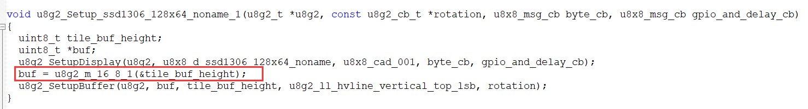

同样用到的函数还有

```
u8g2_m_16_8_1
u8g2_m_16_8_2
u8g2_m_16_8_f
```

其他的就都可以删除了

## STM32接口编写

我们需要一个接口文件进行初始化，这里我写了一个接口文件放在了u8g2文件夹中，定义为**u8g2_stm32_port.c**

然后我们需要编写一个关于u8g2的接口函数对其进行初始化等，我觉得最好使用IIC在外面定义的方式，即使你是使用的软件IIC，我感觉最好也不要用这个里面的软件IIC，最好自己写了IIC直接把接口放进来。

需要初始化的有两个部分，一个是IIC部分接口，一个是延时函数部分接口。

还可以使用SPI驱动的，暂时没写。

### iic部分

```c
uint8_t u8x8_byte_hw_i2c(u8x8_t *u8x8, uint8_t msg, uint8_t arg_int, void *arg_ptr)
{
    /* u8g2/u8x8 will never send more than 32 bytes between START_TRANSFER and END_TRANSFER */
    static uint8_t buffer[128];
    static uint8_t buf_idx;
    uint8_t *data;
 
    switch (msg)
    {
    case U8X8_MSG_BYTE_INIT:
    {
        /* add your custom code to init i2c subsystem */
        //I2C初始化
		//HAL库会在之前就初始化，所以这里不做处理
    }
    break;
 
    case U8X8_MSG_BYTE_START_TRANSFER:
    {
        buf_idx = 0;
    }
    break;
 
    case U8X8_MSG_BYTE_SEND:
    {
        data = (uint8_t *)arg_ptr;
 
        while (arg_int > 0)
        {
            buffer[buf_idx++] = *data;
            data++;
            arg_int--;
        }
    }
    break;
 
    case U8X8_MSG_BYTE_END_TRANSFER:
    {
		u_i2c_master_transmit_bytes(&hi2c1,u8x8_GetI2CAddress(u8x8), buffer, buf_idx,1000);
    }
    break;
 
    case U8X8_MSG_BYTE_SET_DC:
        break;
 
    default:
        return 0;
    }
 
    return 1;
}
```

### 延时函数部分

```c
uint8_t u8x8_gpio_and_delay(u8x8_t *u8x8, uint8_t msg, uint8_t arg_int, void *arg_ptr)
{
    
	switch(msg){
	case U8X8_MSG_DELAY_MILLI:
		HAL_Delay(arg_int);
	    break;
	default:	
		return 0;
	}
	return 1; // command processed successfully.
}
```

### 初始化

```c
//U8g2的初始化，需要调用下面这个u8g2_Setup_ssd1306_128x64_noname_f函数，该函数的4个参数含义：
//u8g2：传入的U8g2结构体
//U8G2_R0：默认使用U8G2_R0即可（用于配置屏幕是否要旋转）
//u8x8_byte_hw_i2c：使用硬件IIC驱动 
//u8x8_gpio_and_delay：就是上面我们写的配置函数
void u8g2Init(u8g2_t *u8g2)
{
	u8g2_Setup_ssd1306_i2c_128x64_noname_f(u8g2, U8G2_R0, u8x8_byte_hw_i2c, u8x8_gpio_and_delay); // 初始化u8g2 结构体
	u8g2_InitDisplay(u8g2);                                                                       // 
	u8g2_SetPowerSave(u8g2, 0);                                                                   // 
	u8g2_ClearBuffer(u8g2);
}
```

然后我们就可以在任务中初始化后调用了，我这里使用了官方的例子

```c
u8g2_t u8g2;

void ui_task(void const * argument)
{
	u8g2Init(&u8g2);
	while(1)
	{	
		u8g2_FirstPage(&u8g2);
		do {
			u8g2_SetFontMode(&u8g2, 1);
			u8g2_SetFontDirection(&u8g2, 0);
			u8g2_SetFont(&u8g2, u8g2_font_inb24_mf);
			u8g2_DrawStr(&u8g2, 0, 20, "U");
			u8g2_SetFontDirection(&u8g2, 1);
			u8g2_SetFont(&u8g2, u8g2_font_inb30_mn);
			u8g2_DrawStr(&u8g2, 21, 8, "8");
			u8g2_SetFontDirection(&u8g2, 0);
			u8g2_SetFont(&u8g2, u8g2_font_inb24_mf);
			u8g2_DrawStr(&u8g2, 51, 30, "g");
			u8g2_DrawStr(&u8g2, 67, 30, "\xb2");
			u8g2_DrawHLine(&u8g2, 2, 35, 47);
			u8g2_DrawHLine(&u8g2, 3, 36, 47);
			u8g2_DrawVLine(&u8g2, 45, 32, 12);
			u8g2_DrawVLine(&u8g2, 46, 33, 12);
			u8g2_SetFont(&u8g2, u8g2_font_4x6_tr);
			u8g2_DrawStr(&u8g2, 1, 54, "github.com/olikraus/u8g2");
		} while (u8g2_NextPage(&u8g2));
		 
		vTaskDelay(10);
	}
}
```

初始化使用编译的时候，会发现报错

```
.\HAL_WithOs\HAL_WithOs.axf: Error: L6406E: No space in execution regions with .ANY selector matching u8g2_fonts.o(.constdata).
```

这个就是内存空间不够，我们找到**u8g2_fonts.c**这个文件，然后先把它**备份**一下，然后删除里面的不常用字体，我这里暂时保留

```
u8g2_font_inb16_mf
u8g2_font_inb24_mf
u8g2_font_inb30_mn
u8g2_font_4x6_tr
```

其他的删除掉，但是要备份，后面如果有需要去备份文件里面找。

## u8g2仿真

如果直接每次都要用单片机下载测试，会发现消耗的时间比较多，u8g2提供了SDL的方式进行模拟仿真，windows环境和linux环境都可以，但是linux环境会相对比较方便。

### Linux环境

下载SDL相关的包，前提make等环境已经配置好了。

```bash
sudo apt-get install net-tools vim git build-essential gcc g++ make zlib* libffi-dev
sudo apt-get install libsdl2-dev
sudo apt-get install libsdl2-image-dev
sudo apt-get install libsdl2-mixer-dev
sudo apt-get install libsdl2-ttf-dev
```

然后进入一个SDL环境的例子包

```bash
cd sys/sdl/hello_numeric/
make
./u8g2_sdl
```

就可以发现显示了

我们在sdl路径下建立一个文件夹，我这里命名BalanceCar，并在其下建立makefile和main.c

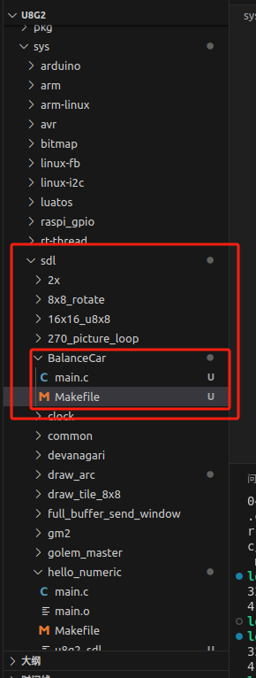

Makefile的内容直接复制其他文件夹的

```
CFLAGS = -g -Wall -I../../../csrc/.  `sdl2-config --cflags`

SRC = $(shell ls ../../../csrc/*.c) $(shell ls ../common/*.c ) main.c 

OBJ = $(SRC:.c=.o)

helloworld: $(OBJ) 
	$(CC) $(CFLAGS) $(LDFLAGS) $(OBJ) `sdl2-config --libs` -o u8g2_sdl

clean:	
	-rm $(OBJ) u8g2_sdl
```

main.c随便写一个显示测试函数

```c
#include "u8g2.h"
#include <stdio.h>

u8g2_t u8g2;

int main(void)
{
    int x, y;
    int k;
    int i;

    u8g2_SetupBuffer_SDL_128x64_4(&u8g2, &u8g2_cb_r0);
    u8x8_InitDisplay(u8g2_GetU8x8(&u8g2));
    u8x8_SetPowerSave(u8g2_GetU8x8(&u8g2), 0);

    u8g2_SetFont(&u8g2, u8g2_font_helvB18_tn);

    x = 50;
    y = 30;
    for (;;)
    {
        u8g2_FirstPage(&u8g2);
        i = 0;
        do
        {
            u8g2_SetFontDirection(&u8g2, 0);
            u8g2_DrawStr(&u8g2, x, y, "123");
            u8g2_SetFontDirection(&u8g2, 1);
            u8g2_DrawStr(&u8g2, x, y, "123");
            u8g2_SetFontDirection(&u8g2, 2);
            u8g2_DrawStr(&u8g2, x, y, "123");
            u8g2_SetFontDirection(&u8g2, 3);
            u8g2_DrawStr(&u8g2, x, y, "123");
            if (i == 1)
            {
                u8g2_DrawHVLine(&u8g2, u8g2.user_x0, u8g2.user_y0, 1, 0);
                u8g2_DrawHVLine(&u8g2, u8g2.user_x0, u8g2.user_y1 - 1, 1, 0);
                u8g2_DrawHVLine(&u8g2, u8g2.user_x1 - 1, u8g2.user_y1 - 1, 1, 0);
                u8g2_DrawHVLine(&u8g2, u8g2.user_x1 - 1, u8g2.user_y0, 1, 0);
            }

            i++;

        } while (u8g2_NextPage(&u8g2));
        
        do
        {
            k = u8g_sdl_get_key();
        } while (k < 0);

        if (k == 273) y -= 7;
        if (k == 274) y += 7;
        if (k == 276) x -= 7;
        if (k == 275) x += 7;

        if (k == 'e') y -= 1;
        if (k == 'x') y += 1;
        if (k == 's') x -= 1;
        if (k == 'd') x += 1;
        if (k == 'q') break;
    }
    return 0;
}
```

然后使用make编译，并执行

```bash
make
./u8g2_sdl
```

就可以看到生成的界面了。

### Windows环境

首先我们需要安装mingw编译环境，这个网上有挺多教程，我暂时不做说明，后续可能会补。安装完成后就有以下目录

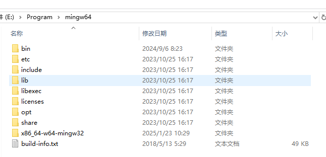

然后我们去下载SDL2相关文件，下载路径：https://github.com/libsdl-org/SDL/releases

他的版本已经到3.x了，但是为了不出问题，我们下载2.x的。下载图中文件。

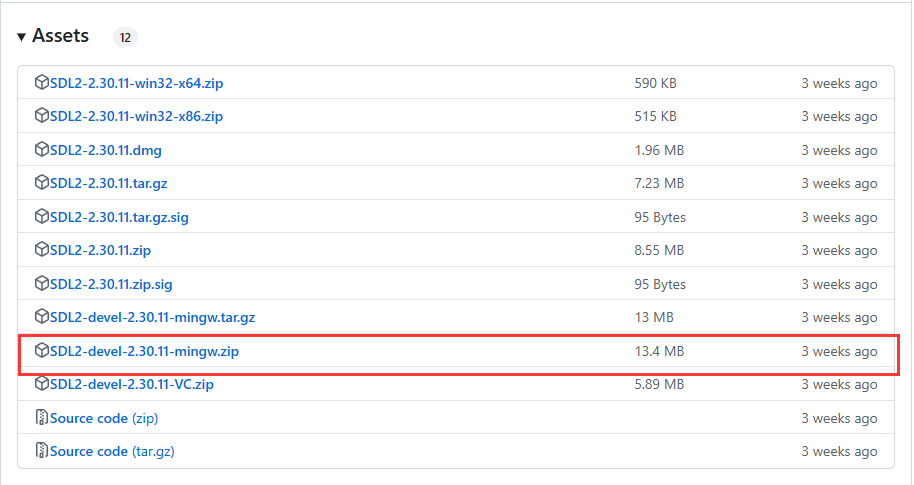

下载后解压，处理**SDL2-devel-2.30.11-mingw.zip**，它解压后应该是如下：

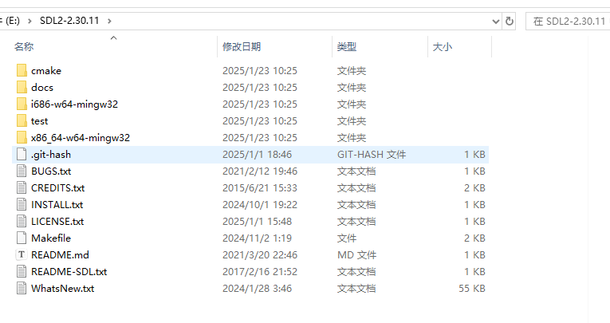

然后把其中的**x86_64-w64-mingw32**文件夹，复制到我们之前安装的mingw的相同文件目录下，复制完成后，能发现有一些文件夹多了SDL相关的配置。

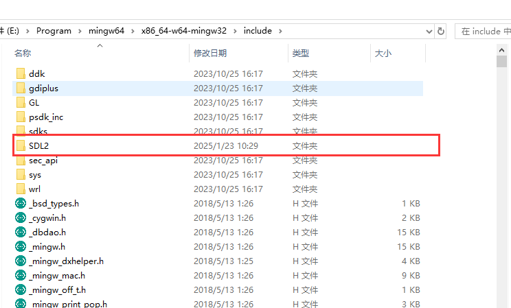

 

为了处理方便，我们建立一个新的文件夹来处理我们的仿真，我这里建立了**sdl-sim**文件夹，然后把**csrc**文件夹放在其中，然后讲**sys/common**文件夹中的两个文件也复制到**csrc**文件夹中。然后写一个Makefile

```makefile
# 编译器
CC = gcc
# 编译选项              记得更换自己的SDL2路径，就在你的mingw64路径下  ！！！！！！！！！！
CFLAGS = -Wall -Wextra -O2 -Icsrc -IE:/Program/mingw64/x86_64-w64-mingw32/include/SDL2
# 链接选项              记得更换自己的路径，就在你的mingw64路径下      ！！！！！！！！！！
LDFLAGS = -LE:/Program/mingw64/x86_64-w64-mingw32/lib -lSDL2
# 目标可执行文件
TARGET = main.exe
# 源文件
SRCS = main.c
# u8g2 源文件
U8G2_SRCS = $(wildcard csrc/*.c)
# 所有源文件
ALL_SRCS = $(SRCS) $(U8G2_SRCS)
# 目标文件
OBJS = $(ALL_SRCS:.c=.o)
# 默认目标
all: $(TARGET)
# 生成可执行文件
$(TARGET): $(OBJS)
	$(CC) -o $@ $^ $(LDFLAGS)
# 编译规则
%.o: %.c
	$(CC) $(CFLAGS) -c $< -o $@
# 清理生成的文件
clean:
	rm -f $(OBJS) $(TARGET)
# 伪目标
.PHONY: all clean
```

并编写一个测试文件main.c。**注意**，测试代码必须要有按键相关的处理，不然会卡死。

```c
#include "csrc/u8g2.h"
#include <stdio.h>

u8g2_t u8g2;

int main(void)
{
  int x, y;

  int k;
  int i;

  u8g2_SetupBuffer_SDL_128x64_4(&u8g2, &u8g2_cb_r0);
  u8x8_InitDisplay(u8g2_GetU8x8(&u8g2));
  u8x8_SetPowerSave(u8g2_GetU8x8(&u8g2), 0);

  u8g2_SetFont(&u8g2, u8g2_font_helvB18_tn);

  x = 50;
  y = 30;

  for (;;)
  {
    u8g2_FirstPage(&u8g2);
    i = 0;
    do
    {
      u8g2_SetFontDirection(&u8g2, 0);
      u8g2_DrawStr(&u8g2, x, y, "123");
      u8g2_SetFontDirection(&u8g2, 1);
      u8g2_DrawStr(&u8g2, x, y, "123");
      u8g2_SetFontDirection(&u8g2, 2);
      u8g2_DrawStr(&u8g2, x, y, "123");
      u8g2_SetFontDirection(&u8g2, 3);
      u8g2_DrawStr(&u8g2, x, y, "123");
      if (i == 1)
      {
        u8g2_DrawHVLine(&u8g2, u8g2.user_x0, u8g2.user_y0, 1, 0);
        u8g2_DrawHVLine(&u8g2, u8g2.user_x0, u8g2.user_y1 - 1, 1, 0);
        u8g2_DrawHVLine(&u8g2, u8g2.user_x1 - 1, u8g2.user_y1 - 1, 1, 0);
        u8g2_DrawHVLine(&u8g2, u8g2.user_x1 - 1, u8g2.user_y0, 1, 0);
      }

      i++;

    } while (u8g2_NextPage(&u8g2));

    do
    {
      k = u8g_sdl_get_key();
    } while (k < 0);

    if (k == 273)
      y -= 7;
    if (k == 274)
      y += 7;
    if (k == 276)
      x -= 7;
    if (k == 275)
      x += 7;

    if (k == 'e')
      y -= 1;
    if (k == 'x')
      y += 1;
    if (k == 's')
      x -= 1;
    if (k == 'd')
      x += 1;
    if (k == 'q')
      break;
  }
  return 0;
}

```

然后在终端中make即可

```bash
make
./main.exe
```

