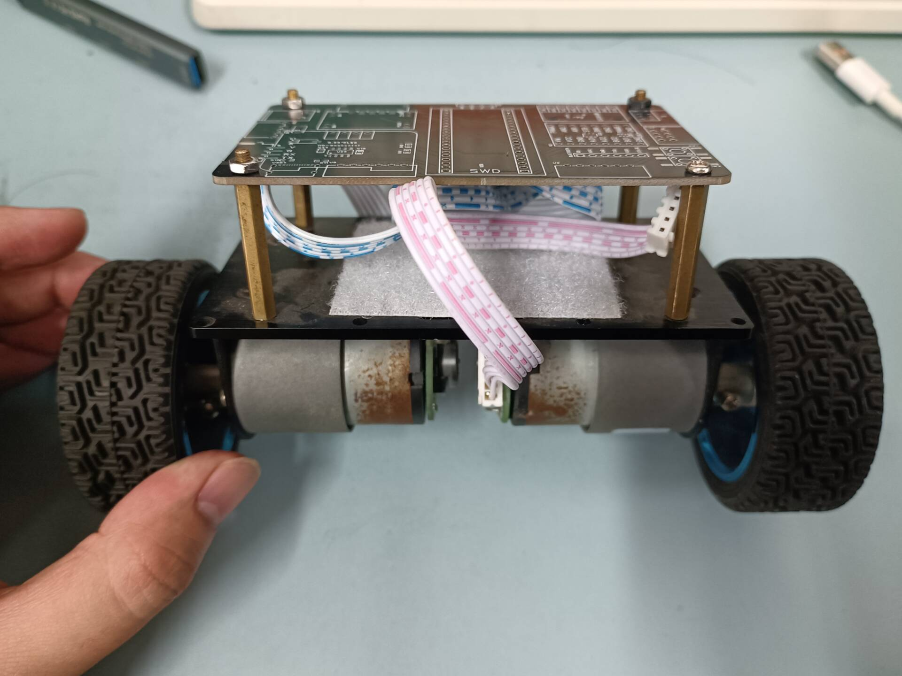
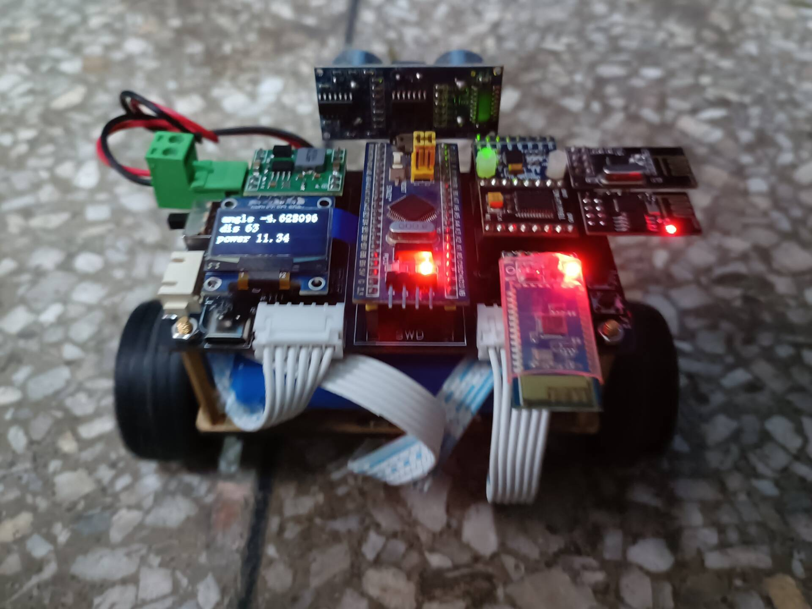
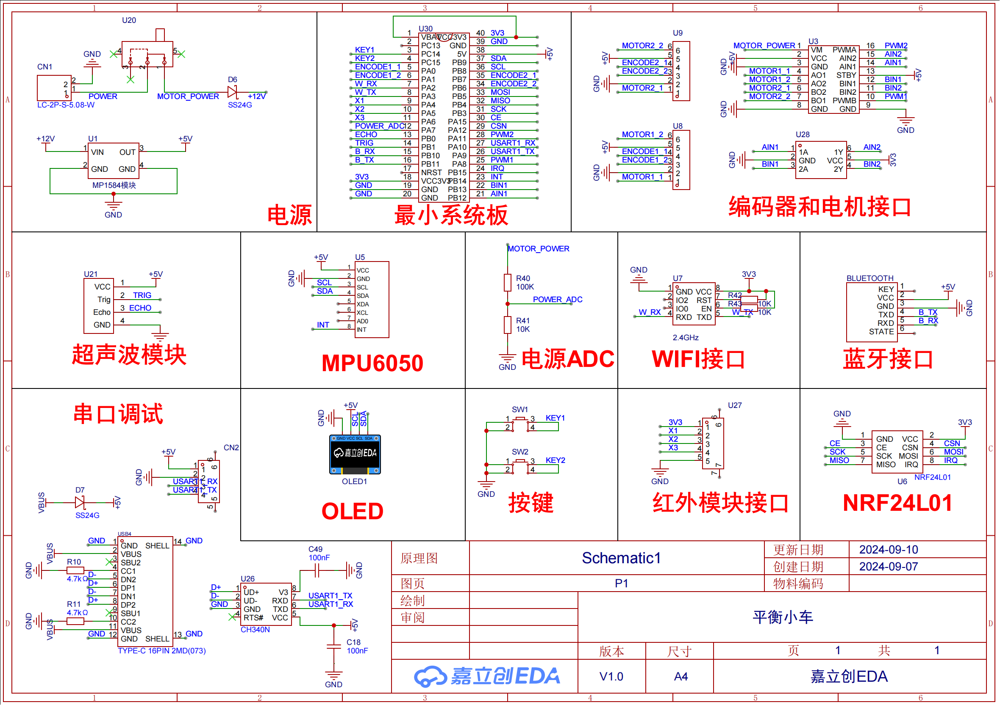

## 2025/7/1更
`control_task.c`里面的以下处理有点问题。导致代码必须插上NRF才能正常工作，不然你把这里注释，自己写逻辑也可以。其实是`NRF_TASK`那里初始化的问题，先记录这个问题，大家查看的时候注意，后面有机会改，但是我感觉我可能难的改了。

```c
  //当4个数据不同时为2048时，认为有数据来
  if(balance_car.rc_data->lx_value != 2048 && 
     balance_car.rc_data->ly_value != 2048 &&
     balance_car.rc_data->rx_value != 2048 &&
     balance_car.rc_data->ry_value != 2048)
  {
    rc_lx_value = (int16_t)((balance_car.rc_data->lx_value - 2048)/64.0f);
    rc_ry_value = (int16_t)((balance_car.rc_data->ry_value - 2048)/64.0f);
    balance_car.speedAim = rc_lx_value;
    balance_car.turnAim  = rc_ry_value;
  }
```

## 2024/12/20更

今天突然发现这个板子也适配我以前的一个比较大的底板




## 项目介绍

项目是基于STM32F103C8T6的平衡车设计，使用的是STM32CubeMx生成的HAL库相关和FreeRTOS相关，主要是为了学习FreeRTOS相关。

## 硬件开源

立创EDA开源地址：

https://oshwhub.com/from_zero/ping-heng-xiao-che

## 实物展示



## 硬件设计

如图所示，具体设计可以看开源文件。使用的是立创EDA绘制的



## 整体框架

主要是分成5个主要的任务。

`control_task`：这个任务主要是实现直立车的控制，MPU6050中断引脚触发STM32单片机的外部中断，然后使用**任务通知**通知控制任务执行对应的控制任务。

`ui_task`：这个任务主要是实现屏幕的显示，ADC读取相关，超声波模块数据的获取和显示。ADC读取使用的是**DMA+多通道**实现，超声波实现使用的是定时器**输入捕获**。

`ble_task`：这个任务主要是实现蓝牙数据的读取，这里可以通过蓝牙收发控制小车。这里实现是串口接收到数据放入**队列**，然后任务读取队列中的数据并进行处理。

`nrf_task`：这个任务主要是实现nrf24l01的读取，这里可以通过nrf收发控制小车。该部分现在未作处理，可自行添加处理。

`esp_task`：这个任务主要是实现esp01的读取，这里可以通过wifi tcp收发控制小车。目前只实现了配置为**AP模式**控制。

## 其他说明

* 由于同时使用了I2C1的引脚和SPI1重映射的引脚，发现会有冲突，所以最后只有I2C使用了硬件，SPI使用的是软件SPI
* 屏幕和MPU6050使用的是同一个IIC总线，所以可能会存在一个使用IIC的时候被打断另外一个也想使用IIC，所以这里使用了**互斥锁**，使得一个在要使用IIC的时候会等另外一个器件协议总线使用完。
* 蓝牙和wifi都是使用的串口，但是串口配置收发DMA的话，只能收，DMA发送只能发送一次，还没解决这个问题。
